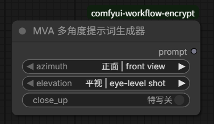

# MVA 多角度提示词生成器 / MVA Prompt Builder

用于 ComfyUI 的无依赖自定义节点，通过中英双语下拉菜单组合 Qwen-Image-2.1 Multiple-Angles LoRA 的 `<mva>` 角度提示词，输出纯英文文本。

A dependency-free ComfyUI custom node that builds `<mva>` angle prompts for the Qwen-Image-2.1 Multiple-Angles LoRA. Dropdown labels are bilingual (Chinese / English), while the generated prompt contains English captions only.

## 安装 / Installation

在终端进入 `ComfyUI/custom_nodes/`，执行以下命令：

Open a terminal in `ComfyUI/custom_nodes/` and run:

```bash
git clone https://github.com/jlongk2005/comfyui-mva-prompt-builder.git
```

也可以在 ComfyUI Manager 里用 **Install via Git URL** 粘贴上面的仓库地址安装；或者点击仓库页面的 **Code → Download ZIP**，解压后将文件夹重命名为 `comfyui-mva-prompt-builder`，再放入 `ComfyUI/custom_nodes/`。请确保 `__init__.py` 和 `nodes.py` 直接位于该文件夹内。

Alternatively, install via **Install via Git URL** in ComfyUI Manager, or click **Code → Download ZIP** on this repository page. Extract the archive, rename the folder to `comfyui-mva-prompt-builder`, and place it in `ComfyUI/custom_nodes/`. Make sure `__init__.py` and `nodes.py` are directly inside that folder.

重启 ComfyUI，在节点搜索中输入 `MVA`，添加 **MVA 多角度提示词生成器**。

Restart ComfyUI, search for `MVA`, and add **MVA 多角度提示词生成器** (MVA Prompt Builder).

<!-- Screenshot: add assets/node.png, then uncomment the image below. -->
<!--  -->

## 使用 / Usage

| 输入或输出 / Input or output | 中文说明 | English description |
| --- | --- | --- |
| `azimuth` | 12 种方位，中英双语显示，如 `正面 \| front view`。 | 12 viewing directions with bilingual labels, such as `正面 \| front view`. |
| `elevation` | 4 种高度角，中英双语显示，如 `平视 \| eye-level shot`。 | 4 camera elevation options with bilingual labels, such as `平视 \| eye-level shot`. |
| `close_up` | 启用后追加 `close-up`。 | Appends `close-up` when enabled. |
| `prompt` | STRING 输出，只包含原始英文 caption，不包含中文。 | STRING output containing the original English captions only, with no Chinese text. |

例如：选择 `右侧面 | right side view`、`高角度俯拍 | high-angle shot`，启用特写，得到：

For example, select `右侧面 | right side view` and `高角度俯拍 | high-angle shot`, then enable `close_up` to generate:

```text
<mva> right side view, high-angle shot close-up
```

将 STRING 输出连接至 CLIP Text Encode 的 `text` 输入。如有必要，在目标节点上右键将文本控件转换为输入。更改控件会改变下一次执行的输出，需要运行工作流才会计算。

Connect the STRING output to the `text` input of CLIP Text Encode. If needed, right-click the text widget on the target node and convert it to an input. Changes to the controls take effect on the next workflow execution; the prompt is calculated when the workflow runs.

## 提示 / Tips

- `<mva>` 触发词必须位于提示词开头，且不要翻译。<br>The `<mva>` trigger must lead the prompt and stay untranslated.
- 角度控制使用 LoRA 训练时的英文 caption：下拉菜单的中文只是为了方便选择，实际输出的英文 label 请勿改动。<br>Angle control uses the English captions used during LoRA training. Chinese dropdown labels are provided for convenience; keep the generated English labels unchanged.
- LoRA 强度建议从 `1.0` 开始；如果生成结果只是在照抄原图、机位转不动，把强度降到 `0.8` 再试。<br>Start LoRA strength at `1.0`; try lowering it to `0.8` if the output copies the input image instead of changing the camera angle.

## 兼容与限制 / Compatibility and limitations

- 本节点只生成提示词，不加载 LoRA，也不负责生图。<br>This node generates prompt text only. It does not load a LoRA or generate images.
- 不需要第三方 Python 包、前端 JavaScript 或 `requirements.txt`。<br>No third-party Python packages, frontend JavaScript, or `requirements.txt` are required.
- 执行层兼容旧版节点的纯英文输入值；旧工作流可能需要重新选择新版下拉框项目并保存。<br>English-only input values from older versions are supported during execution. Older workflows may require reselecting the current dropdown options and saving the workflow.

## 参考 / Reference

[Qwen-Image-2.1 Multiple-Angles LoRA](https://huggingface.co/akhaliq/Qwen-Image-2.1-Multiple-Angles-LoRA) by [@_akhaliq](https://x.com/_akhaliq) — 本节点为其配套的提示词组合工具 / the LoRA this node is built for.

## 许可 / License

[MIT](LICENSE)
